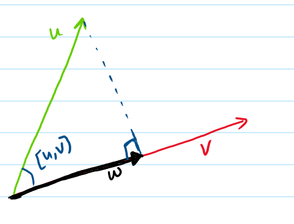
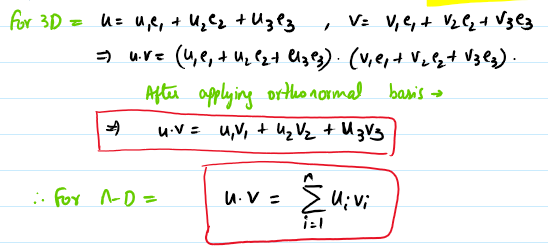

In this blog I would like write about the dot product between vectors. It is also called as **scalar product**.
- Dot product is very important concept in linear algebra, it helps determining the length and angle between the vectors.

1. dot product: \\
The dot product b/w teo vectors is denoted by $\vec{u} \cdot \vec{v}$. The product is always a *scalar value*(which is why it is called as a scalar product).
- $$
u \cdot v = 
\begin{cases} 
\|u\| \|v\| \cos[u, v], & \text{if } u \neq 0 \text{ and } v \neq 0, \\ 
0, & \text{if } u = 0 \text{ or } v = 0. 
\end{cases} $$
- $\|\|\mathbf{u}\|\|$ is the length of the vector **u**. And it is given by for ex in 3D: $\|\|\mathbf{u}\|\| = \sqrt{u_x^2 + u_y^2 + u_z^2}$
- $[u,v]$ is the angle between the two vectors and this has a specific implocation in the outcome of the dot product.
    - The dot product is +ve ($u \cdot v$) $\iff 0<[u,v]<\pi/2$
    - The dot product is -ve ($u \cdot v$) $\iff \pi/2<[u,v]<\pi$
    - The dot product is **0** ($u \cdot v$) $\iff [u,v]=\pi/2$ or u=0 or v = 0 **(This says that when the dot product is 0, the tow vectors are orthogonal)**

2. Normalization: \\
A unit vector can be produced from a non zero vector. This process is called as normalization and the produced vector is called as normalized vector. 
- $n = \frac{\mathbf{u}}{\|\|u\|\|}$. Simply divide the vector with its length.
- This is an useful concept to just preserve the information on the direction of the vector. \\

3. One more area where the dot product is very useful is when we try to project a vector u onto another vector v. Also called as **Orthogonal projection**.
- 

4. Dot product in orthonormal basis:\\

- The dot product for an **orthonormal basis** is such that 
$$
e_i \cdot e_j = 
\begin{cases}
0, & \text{if} & i \ne j, \\
1, & \text{if} & i = j.
\end{cases}
$$
- This presents an interesting formula to find the dot product b/w two vectors
    - Say $\vec{u} = u_1e_1+ u_2e_2 + u_3e_3$ and $\vec{v}= v_1e_1+ v_2e_2 + v_3e_3$
    - Then $u \cdot v$ is given by:
    
    

